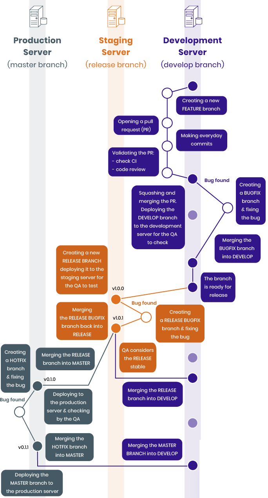

## Git Workflow Model

1. **Master** —This is a highly stable branch that is always production-ready and contains the last release version of source code in production.
2. **Develop** —Derived from the master branch, the development branch serves as a branch for integrating different features planned for an upcoming release. This branch may or may not be as stable as the master branch. It is where developers collaborate and merge feature branches.

| **Note:** The previous two branches are the starting points for any project. They are very important and should be protected against accidental deletion until the project is better defined. Only authorized leads or project owners should be given the responsibility to merge changes from other branches such as the feature branch |
| --- |

Apart from those two primary branches, there are other branches in the workflow:

1. **Feature -** These branches are created from develop; each feature branch is used to implement a single task. After completing the task, the feature branch must be merged into develop. To avoid ambiguity, we use a specific naming convention for feature branches − they always begin with feature/ followed by a description based on the functionality implemented by the feature. For example: **feature/sign-up-with-email-and-password**. Thanks to this naming, team members can easily tell what code each branch contains.

2. **Release -** This branch is created every iteration (i.e. sprint) from develop, and when the team rolls out a release it&#39;s deployed to the staging server for testing. A stable release is merged first into the master branch and then into develop. The naming convention for this branch starts with release/ followed by its version. For example, **release/v1.0.1.**

3. **Hotfix -** This branch is created for handling emergency situations − it allows developers to quickly fix something in production. This branch uses master as the parent branch and merges into both master and develop. The name of this branch starts with hotfix/ followed by its version. For example, **hotfix/v0.1.1.**

4. **Bugfix -** These branches are created in case the release requires bug fixes. The parent branch depends on the circumstances: it can be either release or develop. The name of this branch starts with bugfix/ followed by the description of what exactly is to be fixed: for example, **bugfix/fix-small-bug**.

**The overall flow is:**

1. **A develop branch is created from master**
2. **Feature branches are created from develop**
3. **When a feature is complete it is merged into the develop branch**
4. **A release branch is created from develop**
5. **When the release branch is done it is merged into develop and master**
6. **If an issue in master(live) is detected a hotfix branch is created from master**
7. **Once the hotfix is complete it is merged to both develop and master**

